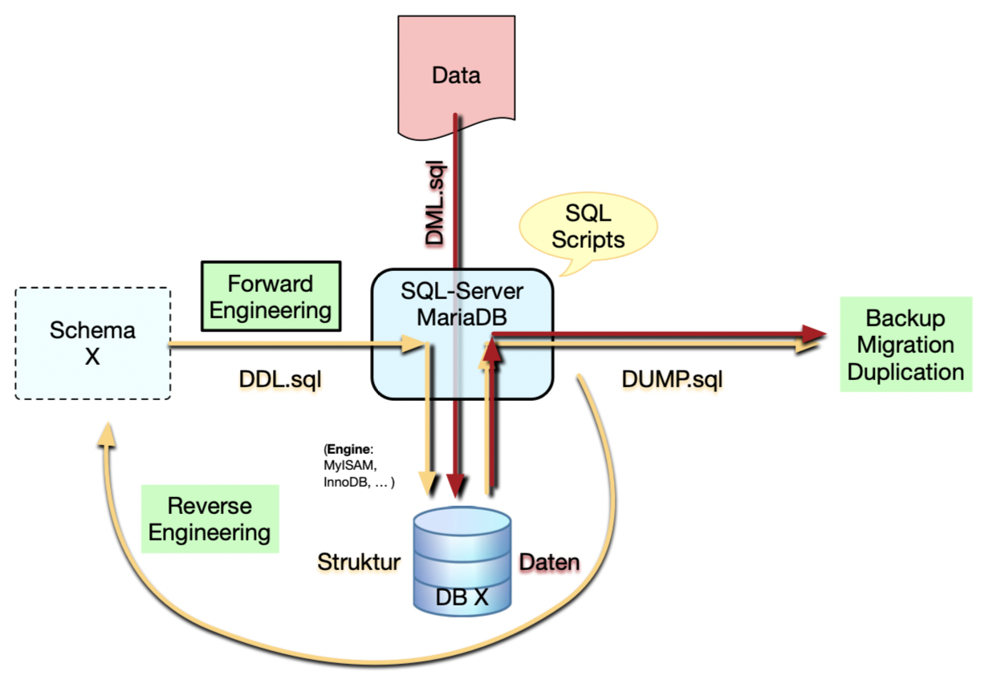
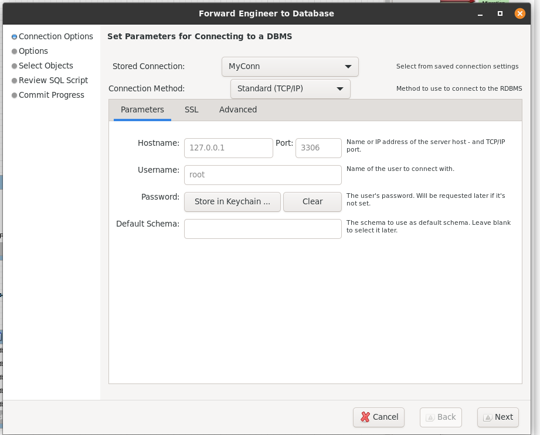
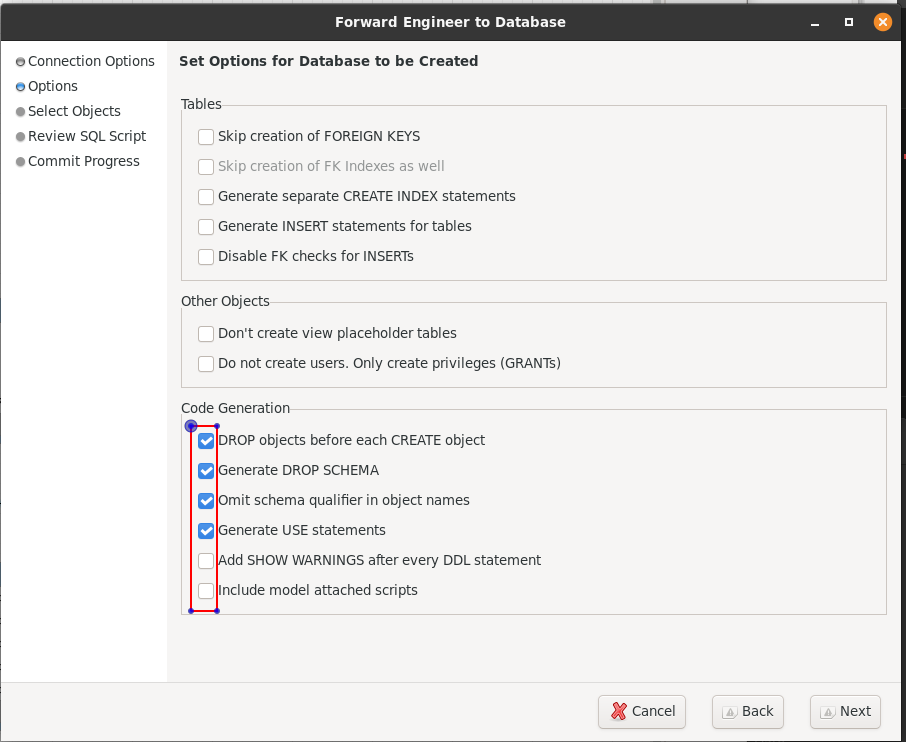
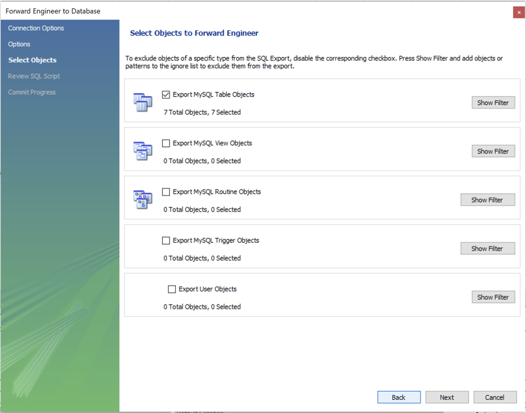
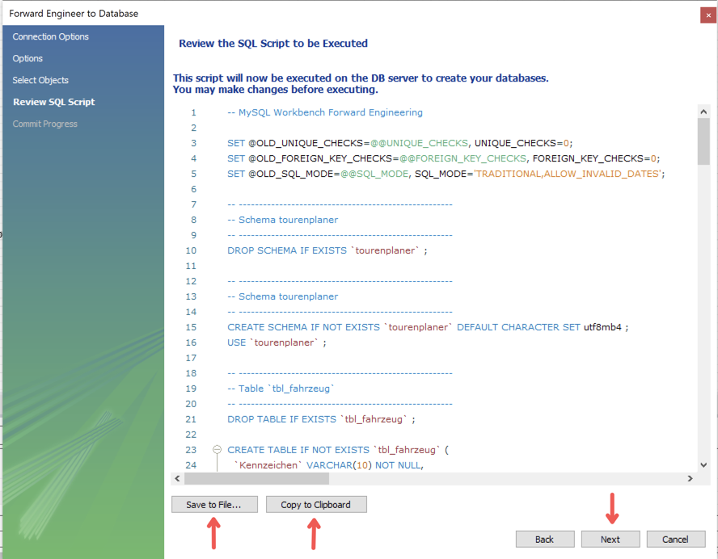
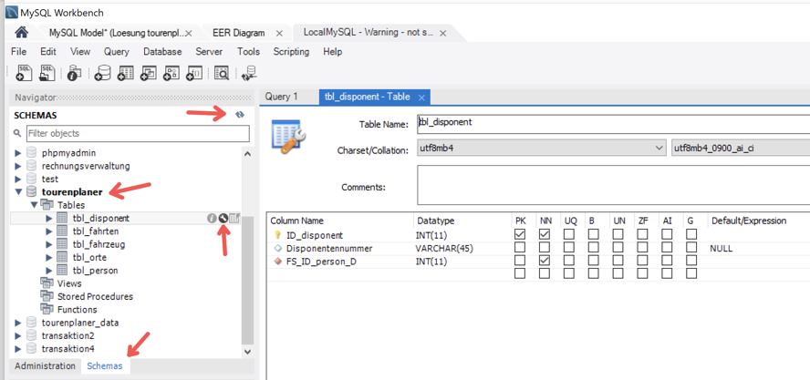

# DDL (Data Definition Language)



Unter **DDL** versteht man das Subset von **SQL**. Es ist eine Sprache zum beschreiben von Daten und ihren Beziehungen in einer Datenbank.
Man kann **DDL** Scrpits generieren um:

- Einen Snapshot der Datenbank zu erstellen
- Eine Test Datenbank zu erstellen die sich wie die Produktionsdatenbank verhält aber keine Produktionsdaten enthält
- Templates für neue Objekte zu erstellen die auf bereits existierenden Objekten basieren.

Beim generieren von **DDL** Scripts, kann man **DDL** Statements verwenden um alles ausser den Daten einer Datenbank zu beschreiben.

## Tutorial

So lässt sich ein **DDL** Script mit MySQL Workbench generieren:

- Zuerst wählt man die **IP-Adresse** des Datenbank-Servers aus:
  
- Dann wählt man welche Statements man generieren lassen will:
  
- Ggf. Filter:
  
- Ein SQL-Script wird generiert:
  
- Mit Next wird das SQL-Script dem DB-Server übermittelt. Verbinden Sie sich nun mit dem DB-Server und lassen Sie sich die neu erstellte Datenstruktur anzeigen:
  

So sieht ein **DDL** Script aus:

```sql
-- MySQL Workbench Forward Engineering

SET @OLD_UNIQUE_CHECKS=@@UNIQUE_CHECKS, UNIQUE_CHECKS=0;
SET @OLD_FOREIGN_KEY_CHECKS=@@FOREIGN_KEY_CHECKS, FOREIGN_KEY_CHECKS=0;
SET @OLD_SQL_MODE=@@SQL_MODE, SQL_MODE='ONLY_FULL_GROUP_BY,STRICT_TRANS_TABLES,NO_ZERO_IN_DATE,NO_ZERO_DATE,ERROR_FOR_DIVISION_BY_ZERO,NO_ENGINE_SUBSTITUTION';

-- -----------------------------------------------------
-- Schema mydb
-- -----------------------------------------------------
-- -----------------------------------------------------
-- Schema Tourenplaner
-- -----------------------------------------------------
DROP SCHEMA IF EXISTS `Tourenplaner` ;

-- -----------------------------------------------------
-- Schema Tourenplaner
-- -----------------------------------------------------
CREATE SCHEMA IF NOT EXISTS `Tourenplaner` DEFAULT CHARACTER SET utf8mb4 ;
USE `Tourenplaner` ;

-- -----------------------------------------------------
-- Table `tb_disponent`
-- -----------------------------------------------------
DROP TABLE IF EXISTS `tb_disponent` ;

CREATE TABLE IF NOT EXISTS `tb_disponent` (
  `id` INT(11) NOT NULL AUTO_INCREMENT,
  `vorname` VARCHAR(45) NULL DEFAULT NULL,
  `nachname` VARCHAR(45) NULL DEFAULT NULL,
  `telefon_nummer` VARCHAR(45) NULL DEFAULT NULL,
  PRIMARY KEY (`id`))
ENGINE = InnoDB
DEFAULT CHARACTER SET = utf8mb4;


-- -----------------------------------------------------
-- Table `tb_fahrer`
-- -----------------------------------------------------
DROP TABLE IF EXISTS `tb_fahrer` ;

CREATE TABLE IF NOT EXISTS `tb_fahrer` (
  `id` INT(11) NOT NULL AUTO_INCREMENT,
  `vorname` VARCHAR(45) NULL DEFAULT NULL,
  `nachname` VARCHAR(45) NULL DEFAULT NULL,
  `telefon_nummer` VARCHAR(45) NULL DEFAULT NULL,
  PRIMARY KEY (`id`))
ENGINE = InnoDB
DEFAULT CHARACTER SET = utf8mb4;


-- -----------------------------------------------------
-- Table `tb_fahrzeug`
-- -----------------------------------------------------
DROP TABLE IF EXISTS `tb_fahrzeug` ;

CREATE TABLE IF NOT EXISTS `tb_fahrzeug` (
  `id` INT(11) NOT NULL AUTO_INCREMENT,
  `fahrzeug_kennzeichen` VARCHAR(45) NOT NULL,
  `sitz_plätze` INT(11) NOT NULL,
  PRIMARY KEY (`id`))
ENGINE = InnoDB
DEFAULT CHARACTER SET = utf8mb4;


-- -----------------------------------------------------
-- Table `tb_fahrt`
-- -----------------------------------------------------
DROP TABLE IF EXISTS `tb_fahrt` ;

CREATE TABLE IF NOT EXISTS `tb_fahrt` (
  `id` INT(11) NOT NULL AUTO_INCREMENT,
  `tb_disponent_id` INT(11) NOT NULL,
  `tb_fahrzeug_id` INT(11) NOT NULL,
  PRIMARY KEY (`id`, `tb_disponent_id`, `tb_fahrzeug_id`),
  INDEX `fk_tb_fahrt_tb_disponent_idx` (`tb_disponent_id` ASC) VISIBLE,
  INDEX `fk_tb_fahrt_tb_fahrzeug1_idx` (`tb_fahrzeug_id` ASC) VISIBLE,
  CONSTRAINT `fk_tb_fahrt_tb_disponent`
    FOREIGN KEY (`tb_disponent_id`)
    REFERENCES `tb_disponent` (`id`)
    ON DELETE NO ACTION
    ON UPDATE NO ACTION,
  CONSTRAINT `fk_tb_fahrt_tb_fahrzeug1`
    FOREIGN KEY (`tb_fahrzeug_id`)
    REFERENCES `tb_fahrzeug` (`id`)
    ON DELETE NO ACTION
    ON UPDATE NO ACTION)
ENGINE = InnoDB
DEFAULT CHARACTER SET = utf8mb4;


-- -----------------------------------------------------
-- Table `tb_stationen`
-- -----------------------------------------------------
DROP TABLE IF EXISTS `tb_stationen` ;

CREATE TABLE IF NOT EXISTS `tb_stationen` (
  `id` INT(11) NOT NULL AUTO_INCREMENT,
  `name` VARCHAR(45) NOT NULL,
  `ankunft` DATETIME NULL DEFAULT NULL,
  `abfahrt` DATETIME NULL DEFAULT NULL,
  PRIMARY KEY (`id`))
ENGINE = InnoDB
DEFAULT CHARACTER SET = utf8mb4;


-- -----------------------------------------------------
-- Table `tb_stationen_has_tb_fahrt`
-- -----------------------------------------------------
DROP TABLE IF EXISTS `tb_stationen_has_tb_fahrt` ;

CREATE TABLE IF NOT EXISTS `tb_stationen_has_tb_fahrt` (
  `tb_stationen_id` INT(11) NOT NULL,
  `tb_fahrt_id` INT(11) NOT NULL,
  `tb_fahrt_tb_disponent_id` INT(11) NOT NULL,
  `tb_fahrt_tb_fahrzeug_id` INT(11) NOT NULL,
  `tb_fahrer_id` INT(11) NOT NULL,
  PRIMARY KEY (`tb_stationen_id`, `tb_fahrt_id`, `tb_fahrt_tb_disponent_id`, `tb_fahrt_tb_fahrzeug_id`, `tb_fahrer_id`),
  INDEX `fk_tb_stationen_has_tb_fahrt_tb_fahrt1_idx` (`tb_fahrt_id` ASC, `tb_fahrt_tb_disponent_id` ASC, `tb_fahrt_tb_fahrzeug_id` ASC) VISIBLE,
  INDEX `fk_tb_stationen_has_tb_fahrt_tb_stationen1_idx` (`tb_stationen_id` ASC) VISIBLE,
  INDEX `fk_tb_stationen_has_tb_fahrt_tb_fahrer1_idx` (`tb_fahrer_id` ASC) VISIBLE,
  CONSTRAINT `fk_tb_stationen_has_tb_fahrt_tb_fahrer1`
    FOREIGN KEY (`tb_fahrer_id`)
    REFERENCES `tb_fahrer` (`id`)
    ON DELETE NO ACTION
    ON UPDATE NO ACTION,
  CONSTRAINT `fk_tb_stationen_has_tb_fahrt_tb_fahrt1`
    FOREIGN KEY (`tb_fahrt_id` , `tb_fahrt_tb_disponent_id` , `tb_fahrt_tb_fahrzeug_id`)
    REFERENCES `tb_fahrt` (`id` , `tb_disponent_id` , `tb_fahrzeug_id`)
    ON DELETE NO ACTION
    ON UPDATE NO ACTION,
  CONSTRAINT `fk_tb_stationen_has_tb_fahrt_tb_stationen1`
    FOREIGN KEY (`tb_stationen_id`)
    REFERENCES `tb_stationen` (`id`)
    ON DELETE NO ACTION
    ON UPDATE NO ACTION)
ENGINE = InnoDB
DEFAULT CHARACTER SET = utf8mb4;


SET SQL_MODE=@OLD_SQL_MODE;
SET FOREIGN_KEY_CHECKS=@OLD_FOREIGN_KEY_CHECKS;
SET UNIQUE_CHECKS=@OLD_UNIQUE_CHECKS;
```
