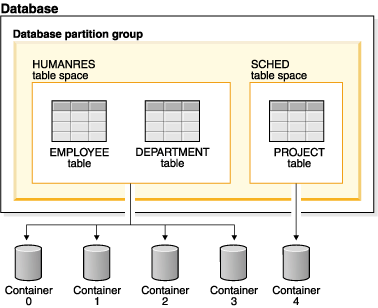

# Storage in einer Datenbank erklären

## Tablespace, Tablespace Architecture

- **Tablespace** ist ein logischer Speicherbereich, der in einer Datenbank erstellt wird, um die Speicherung von Tabellen, Indizes und großen Objekten zu verwalten. Diese Speicherbereiche werden benutzt, um Daten zu organisieren die zum System gehören. **Table spaces** werden in **Database Partition** Gruppen gespeichert. **Table spaces** bestehen aus einem oder mehreren _Containers_. Ein Container kann ein Ordner Name, ein Gerät Name oder ein Datei Name sein. Ein einziger **Tablespace** kann aus mehreren _Containers_ bestehen. Es ist möglich mehrere Containers (von einem oder mehreren Table Spaces) auf einem physischen Speichergerät zu kreieren (die beste Perfomance erhält man jedoch, wenn jeder Container auf einem eigenen physischen Gerät liegt). Nutzt man automatische _Storage Tables_ so wird der Speicherplatz automatisch vom DBMS verwaltet.

- **Tablespace Architecture**: 

> **Quelle:** > [IBM](https://www.ibm.com/docs/en/db2/11.1?topic=databases-table-spaces)

## Partition

Eine **Partition** ist eine Division einer logischen Datenbank oder ihren konstituierenden Elementen in unabhängige, nicht überlappende Bereiche. Jede Partition kann unabhängig verwaltet werden. Partitionen können auf verschiedene Arten erstellt werden, z.B. durch die Verwendung von **Tablespaces** oder **Database Partitions**.

## Storage Engine

Eine **Storage Engine** ist ein Bestandteil eines Datenbankmanagementsystems (DBMS), der für die Verwaltung von Speicher und die Organisation von Daten verantwortlich ist. Die **Storage Engine** ist für die Speicherung, das Abrufen und die Verwaltung von Daten in einer Datenbank verantwortlich. Die **Storage Engine** ist ein wichtiger Bestandteil eines DBMS, da sie die Datenbankleistung und -funktionalität beeinflusst. Ihre wesentliche Aufgabe besteht in sogenannten CRUD-Operationen (Create, Read, Update, Delete) und der Verwaltung von Indizes. Die meisten **DBMS** haben ihre eigene **Storage Engine** die die Interaktion mit der unerliegenden Engine übernimmt.

> **Quelle**:
> [IBM](https://www.ibm.com/docs/en/db2/11.1?topic=databases-table-spaces)
> [Wikipedia](<https://en.wikipedia.org/wiki/Partition_(database)>)
