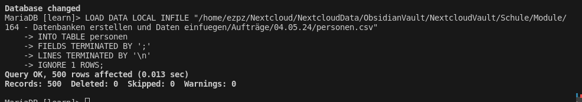

# Bulkimport: Mysql Data Loader

Mysql bietet die Möglichkeit CSV-Files effizient und schnell in eine Tabelle mit gleichen Spalten einzulesen.

Das Kommando dazu heist `LOAD DATA INFILE "/path/file.csv"`.
Mit diesem Kommando, versucht MariaDB Server, die Eingabedatei aus seinem eigenen Dateisystem zu lesen. Ohne Pfadangabe sucht der Server die Datei im Data-Verzeichnis der aktuellen Datenbasis: `C:\...\mySQL\data\db\`.

`LOAD DATA LOCAL INFILE "c:\\path\\file.csv"`

Wenn Sie dagegen diese Anweisung ausführen, versucht der Client, die Eingabedatei aus seinem Dateisystem zu lesen, und sendet den Inhalt der Eingabedatei an den MariaDB Server. Auf diese Weise können Sie Dateien aus dem lokalen Dateisystem des Clie`ts in die Datenbank laden.

Es sollte folgende Einstellungen in der `my.ini` Datei vorgenommen werden:

```ini
[mysqld]
local-infile=1
```

Bei **Workbench** kann bei **Manage Server Connections** -> **Advanced** -> **Others** folgende Einstellung vorgenommen werden:

```ini
OPT_LOCAL_INFILE=1
```

## Auftrag 1

Wir haben eine CSV-Datei **personen.csv** mit folgendem Inhalt:

```csv
id;Vorname;Nachname;Geburtsdatum
1;Antje;Fein;2004-09-01
2;Reimund;Niewöhner;2010-07-30
3;Jannik;Steuernagel;2018-05-18
4;Hadburg;Häußler;2003-04-13
5;Heliane;Balci;2005-12-30
---
```

Um die Datei zu importieren, benötigen wir zuerst eine Tabelle mit den gleichen Spalten:

```sql
CREATE TABLE personen (
    id INT PRIMARY KEY,
    Vorname VARCHAR(50),
    Nachname VARCHAR(50),
    Geburtsdatum DATE
);
```

Nun können wir die Datei importieren:

```sql
LOAD DATA LOCAL INFILE "/home/ezpz/Nextcloud/NextcloudData/ObsidianVault/NextcloudVault/Schule/Module/164 - Datenbanken erstellen und Daten einfuegen/Aufträge/04.05.24/personen.csv"
INTO TABLE personen
FIELDS TERMINATED BY ';'
LINES TERMINATED BY '\n'
IGNORE 1 ROWS;
```


