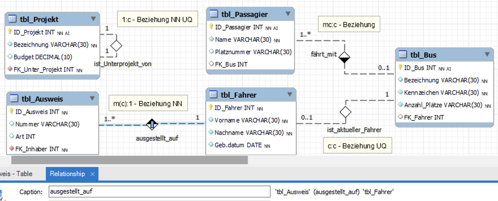
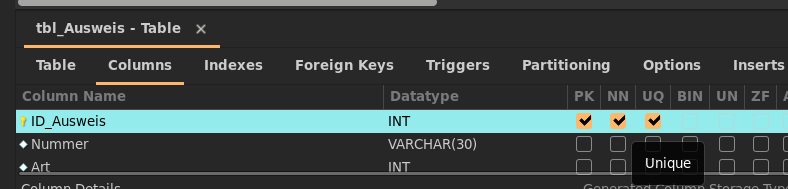

# DDL CREATE Relations

## Forward Engineering



### DDL

```sql
-- MySQL Workbench Forward Engineering

SET @OLD_UNIQUE_CHECKS=@@UNIQUE_CHECKS, UNIQUE_CHECKS=0;
SET @OLD_FOREIGN_KEY_CHECKS=@@FOREIGN_KEY_CHECKS, FOREIGN_KEY_CHECKS=0;
SET @OLD_SQL_MODE=@@SQL_MODE, SQL_MODE='ONLY_FULL_GROUP_BY,STRICT_TRANS_TABLES,NO_ZERO_IN_DATE,NO_ZERO_DATE,ERROR_FOR_DIVISION_BY_ZERO,NO_ENGINE_SUBSTITUTION';

-- -----------------------------------------------------
-- Schema mydb
-- -----------------------------------------------------
DROP SCHEMA IF EXISTS `mydb` ;

-- -----------------------------------------------------
-- Schema mydb
-- -----------------------------------------------------
CREATE SCHEMA IF NOT EXISTS `mydb` DEFAULT CHARACTER SET utf8 ;
USE `mydb` ;

-- -----------------------------------------------------
-- Table `tbl_Projekt`
-- -----------------------------------------------------
DROP TABLE IF EXISTS `tbl_Projekt` ;

CREATE TABLE IF NOT EXISTS `tbl_Projekt` (
  `ID_Projekt` INT NOT NULL AUTO_INCREMENT,
  `Bezeichnung` VARCHAR(30) NOT NULL,
  `Budget` DECIMAL(10) NULL,
  `tbl_Projekt_ID_Projekt` INT NOT NULL,
  PRIMARY KEY (`ID_Projekt`),
  CONSTRAINT `fk_tbl_Projekt_tbl_Projekt1`
    FOREIGN KEY (`tbl_Projekt_ID_Projekt`)
    REFERENCES `tbl_Projekt` (`ID_Projekt`)
    ON DELETE NO ACTION
    ON UPDATE NO ACTION)
ENGINE = InnoDB;

CREATE INDEX `fk_tbl_Projekt_tbl_Projekt1_idx` ON `tbl_Projekt` (`tbl_Projekt_ID_Projekt` ASC) VISIBLE;


-- -----------------------------------------------------
-- Table `tbl_Fahrer`
-- -----------------------------------------------------
DROP TABLE IF EXISTS `tbl_Fahrer` ;

CREATE TABLE IF NOT EXISTS `tbl_Fahrer` (
  `ID_Fahrer` INT NOT NULL,
  `Vorname` VARCHAR(30) NOT NULL,
  `Nachname` VARCHAR(30) NOT NULL,
  `Geb.datum` DATE NOT NULL,
  PRIMARY KEY (`ID_Fahrer`))
ENGINE = InnoDB;


-- -----------------------------------------------------
-- Table `tbl_Bus`
-- -----------------------------------------------------
DROP TABLE IF EXISTS `tbl_Bus` ;

CREATE TABLE IF NOT EXISTS `tbl_Bus` (
  `ID_Bus` INT NOT NULL AUTO_INCREMENT,
  `Bezeichnung` VARCHAR(30) NOT NULL,
  `Kennzeichen` VARCHAR(30) NOT NULL,
  `Anzahl_Plätze` VARCHAR(30) NOT NULL,
  `FK_Fahrer` INT NOT NULL,
  PRIMARY KEY (`ID_Bus`),
  CONSTRAINT `fk_tbl_Bus_tbl_Fahrer1`
    FOREIGN KEY (`FK_Fahrer`)
    REFERENCES `tbl_Fahrer` (`ID_Fahrer`)
    ON DELETE NO ACTION
    ON UPDATE NO ACTION)
ENGINE = InnoDB;

CREATE INDEX `fk_tbl_Bus_tbl_Fahrer1_idx` ON `tbl_Bus` (`FK_Fahrer` ASC) VISIBLE;


-- -----------------------------------------------------
-- Table `tbl_Ausweis`
-- -----------------------------------------------------
DROP TABLE IF EXISTS `tbl_Ausweis` ;

CREATE TABLE IF NOT EXISTS `tbl_Ausweis` (
  `ID_Ausweis` INT NOT NULL,
  `Nummer` VARCHAR(30) NULL,
  `Art` INT NULL,
  `tbl_Fahrer_ID_Fahrer` INT NOT NULL,
  PRIMARY KEY (`ID_Ausweis`),
  CONSTRAINT `fk_tbl_Ausweis_tbl_Fahrer1`
    FOREIGN KEY (`tbl_Fahrer_ID_Fahrer`)
    REFERENCES `tbl_Fahrer` (`ID_Fahrer`)
    ON DELETE NO ACTION
    ON UPDATE NO ACTION)
ENGINE = InnoDB;

CREATE INDEX `fk_tbl_Ausweis_tbl_Fahrer1_idx` ON `tbl_Ausweis` (`tbl_Fahrer_ID_Fahrer` ASC) VISIBLE;


-- -----------------------------------------------------
-- Table `tbl_Passagier`
-- -----------------------------------------------------
DROP TABLE IF EXISTS `tbl_Passagier` ;

CREATE TABLE IF NOT EXISTS `tbl_Passagier` (
  `ID_Passagier` INT NOT NULL AUTO_INCREMENT,
  `Name` VARCHAR(30) NOT NULL,
  `Platznummer` VARCHAR(30) NULL,
  `tbl_Bus_ID_Bus` INT NOT NULL,
  PRIMARY KEY (`ID_Passagier`),
  CONSTRAINT `fk_tbl_Passagier_tbl_Bus1`
    FOREIGN KEY (`tbl_Bus_ID_Bus`)
    REFERENCES `tbl_Bus` (`ID_Bus`)
    ON DELETE NO ACTION
    ON UPDATE NO ACTION)
ENGINE = InnoDB;

CREATE INDEX `fk_tbl_Passagier_tbl_Bus1_idx` ON `tbl_Passagier` (`tbl_Bus_ID_Bus` ASC) VISIBLE;


SET SQL_MODE=@OLD_SQL_MODE;
SET FOREIGN_KEY_CHECKS=@OLD_FOREIGN_KEY_CHECKS;
SET UNIQUE_CHECKS=@OLD_UNIQUE_CHECKS;
```

## Analyse

1. **Allgemeiner Syntax für CONSTRAINT-Anweisungen**
   ```sql
   CONSTRAINT <Name_der_Fremdschlüssel>
   FOREIGN KEY (<Name_der_Spalte>)
   REFERENCES <Name_der_Tabelle> (<Name_der_Spalte>)
   ON DELETE <Aktion>
   ON UPDATE <Aktion>
   ```
   - Beispiel:
   ```sql
   CREATE TABLE `tbl_Mytbl` (
     `ID_Mytbl` INT NOT NULL AUTO_INCREMENT,
     `Name` VARCHAR(30) NOT NULL,
     `tbl_Mytbl_ID_Mytbl` INT NOT NULL,
     PRIMARY KEY (`ID_Mytbl`),
     CONSTRAINT `fk_tbl_Mytbl_tbl_Mytbl1`
       FOREIGN KEY (`tbl_Mytbl_ID_Mytbl`)
       REFERENCES `tbl_Mytbl` (`ID_Mytbl`)
       ON DELETE NO ACTION
       ON UPDATE NO ACTION)
   ```
2. **Erstellen von NOT NULL-Constraints bei Fremdschlüsseln**

   - Beispiel:

   ```sql
   CREATE TABLE `tbl_Mytbl` (
     `ID_Mytbl` INT NOT NULL AUTO_INCREMENT,
     `Name` VARCHAR(30) NOT NULL,
     `tbl_Mytbl_ID_Mytbl` INT NOT NULL,
     PRIMARY KEY (`ID_Mytbl`),
     CONSTRAINT `fk_tbl_Mytbl_tbl_Mytbl1`
       FOREIGN KEY (`tbl_Mytbl_ID_Mytbl`)
       REFERENCES `tbl_Mytbl` (`ID_Mytbl`)
       ON DELETE NO ACTION
       ON UPDATE NO ACTION)
   ```

3. **Grund für INDEX bei Fremdschlüsseln**

   - Ein Index auf einer Fremdschlüsselspalte kann die Leistung verbessern, wenn Sie Abfragen ausführen, die die Fremdschlüsselspalte verwenden, oder wenn Sie die Fremdschlüsselspalte in JOIN-Abfragen verwenden.
   - Beispiel:

   ```sql
   CREATE TABLE `tbl_Mytbl` (
     `ID_Mytbl` INT NOT NULL AUTO_INCREMENT,
     `Name` VARCHAR(30) NOT NULL,
     `tbl_Mytbl_ID_Mytbl` INT NOT NULL,
     PRIMARY KEY (`ID_Mytbl`),
     CONSTRAINT `fk_tbl_Mytbl_tbl_Mytbl1`
       FOREIGN KEY (`tbl_Mytbl_ID_Mytbl`)
       REFERENCES `tbl_Mytbl` (`ID_Mytbl`)
       ON DELETE NO ACTION
       ON UPDATE NO ACTION);

   CREATE INDEX `fk_tbl_Mytbl_tbl_Mytbl1_idx` ON `tbl_Mytbl` (`tbl_Mytbl_ID_Mytbl` ASC) VISIBLE;
   ```

   > **INDEX**: Ein Index ist eine Datenstruktur, die die Suche nach bestimmten Zeilen in einer Tabelle beschleunigt. Ohne einen Index muss die Datenbank-Engine jede Zeile in der Tabelle durchsuchen, um die Zeilen zu finden, die den Suchkriterien entsprechen. Wenn eine Tabelle viele Zeilen enthält, kann dies sehr zeitaufwändig sein. Ein Index ist eine Datenstruktur, die eine schnelle Suche nach Zeilen in einer Tabelle ermöglicht, basierend auf den Werten in einer oder mehreren Spalten der Tabelle.

4. **Erstellen von Constraint UNIQUE in MySQL Workbench durch Forward Engineering**



ALTER TABLE <> ADD CONSTRAINT <> FOREIGN KEY ...
Mit ALTER TABLE können Fremdschlüssel manuell auch nachträglich eingefügt werden.
Fremdschlüssel hinzufügen:

```sql
ALTER TABLE <DetailTab>
  ADD CONSTRAINT <Constraint> FOREIGN KEY (<Fremdschlüssel>)
  REFERENCES <MasterTab> (Primärschlüssel);
```

## ALTER TABLE <> ADD CONSTRAINT <> FOREIGN KEY ...

Mit ALTER TABLE können Fremdschlüssel manuell auch nachträglich eingefügt werden.

Fremdschlüssel hinzufügen:

```sql

ALTER TABLE <DetailTab>
  ADD CONSTRAINT <Constraint> FOREIGN KEY (<Fremdschlüssel>)
  REFERENCES <MasterTab> (Primärschlüssel);

```

| `<Wert>`            | Erklärung                                                                                                |
| ------------------- | -------------------------------------------------------------------------------------------------------- |
|  `<DetailTab>`      | Name der Detailtabelle                                                                                   |
| `<Constraint>`      | Frei definierbarer Name. Mögliche Namenskonvention: FK_Detailtabelle_Mastertabelle, z.B. FK_Autoren_Ort. |
| `<Fremdschlüssel>`  | Name des Fremdschlüsselattributes der Detailtabelle                                                      |
| `<MasterTab>`       | Name der Master-/Primärtabelle                                                                           |
| `<Primärschlüssel>` | Name des Primärschlüsselattributes der Master-/Primärtabelle                                             |

Eindeutiger Schlüssel hinzufügen (z.B. darf jeder Fremdschlüsselwert max. 1x vorkommen):

```sql

ALTER TABLE <Tabelle>
  ADD UNIQUE (<Spalte>);

```
