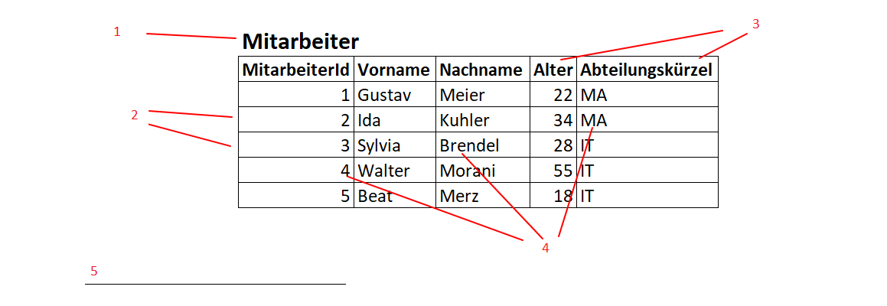

# Fragen und Antworten zu Auftrag 02.23.24

**Wie werden Netzwerk-Beziehungen im logischen Modell abgebildet?**
Netzwerk-Beziehungen werden im logischen Modell durch die Verknüpfung von Tabellen abgebildet. Dabei wird eine Tabelle mit einer anderen Tabelle verknüpft, indem die Primärschlüssel der einen Tabelle in der anderen Tabelle als Fremdschlüssel gespeichert werden.

**Was sind Anomalien in einer Datenbasis? Welche Arten gibt es?**
Anomalien bezeichnen in der Datenbanktheorie Fehler, die durch die Strukturierung der Daten entstehen. Es gibt drei Arten von Anomalien:

- Einfügeanomalie: Ein neuer Datensatz kann nicht eingefügt werden, weil dazu ein weiterer Datensatz benötigt wird.
- Löschanomalie: Beim Löschen eines Datensatzes gehen auch andere Daten verloren.
- Änderungsanomalie: Änderungen an einem Datensatz müssen an mehreren Stellen vorgenommen werden.

**Gibt es redundante "Daten"? Warum?**
Ja, es gibt redundante Daten. Das liegt daran, dass Daten in einer Datenbank nicht nur in einer Tabelle gespeichert werden, sondern auch in anderen Tabellen, die mit der ersten Tabelle in Beziehung stehen. Das ist notwendig, um die Daten zu strukturieren und zu verknüpfen.

**Datenstrukturierung: Welche zwei Aspekte können strukturiert werden? Welche Kategorien (Abstufungen) gibt es bei der Strukturierung? Und wie müssen die Daten in einer DB strukturiert sein?**
Bei der Datenstrukturierung können zwei Aspekte strukturiert werden: die Daten selbst und die Beziehungen zwischen den Daten. Die drei Katgorien der Strukturierung sind:

1. Unstrukturierte Daten
2. Strukturierte Daten
3. Semi-strukturierte Daten

In einer Datenbank müssen Daten so strukturiert sein, so dass sie dem Datenbankmodell entsprechen und die Beziehungen zwischen den Daten korrekt abgebildet sind.

**Beschreiben das Bild mit den richtigen Fachbegriffen**

1. **Name der Tabelle**
2. **Primärschlüssel**
3. **Tabellenname**
4. **Tabellenzeile**

> **Quellen**: https://de.wikipedia.org/wiki/Anomalie_(Informatik)
