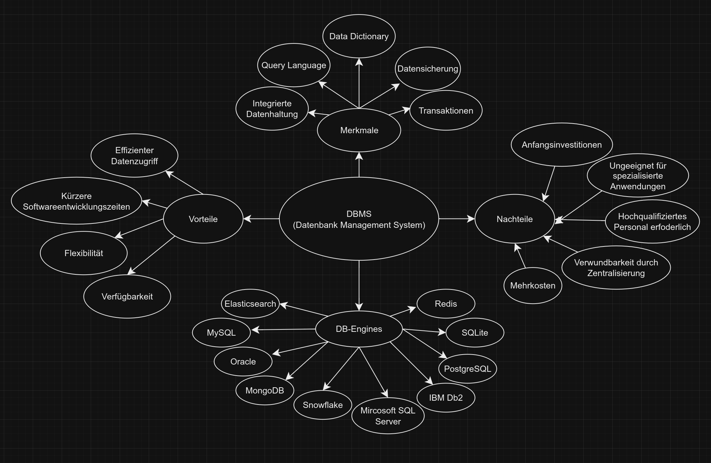

# Daten Management System (DBMS)

## Was ist ein DBMS?

Ein Datenbankmanagementsystem (DBMS) ist ein Systemsoftwarepaket, das Computeranwendungen die Interaktion mit einer oder mehreren Datenbanken ermöglicht. Es ist eine umfassende Software, die als Schnittstelle zwischen den Benutzern und der Datenbank dient. Es verwaltet die Organisation, Speicherung, Abruf, Sicherung und Wiederherstellung von Daten in einer Datenbank.

## Aufgaben eines DBMS

- **Datenverwaltung**: Ein DBMS speichert, verwaltet und organisiert Daten in einer Datenbank. Es ermöglicht Benutzern, Daten zu speichern, zu bearbeiten und abzurufen.

- **Datenintegrität**: Ein DBMS implementiert Mechanismen, um die Integrität der Daten zu gewährleisten. Es stellt sicher, dass die Daten in der Datenbank konsistent und korrekt sind.

- **Datenunabhängigkeit**: Ein DBMS ermöglicht es, die Daten von den Anwendungen zu trennen, die sie verwenden. Dies bedeutet, dass Änderungen an der Datenbankstruktur keine Auswirkungen auf die Anwendungen haben, die die Datenbank verwenden.

- **Datenzugriffskontrolle**: Ein DBMS implementiert Sicherheitsmechanismen, um den Zugriff auf die Datenbank zu steuern. Es ermöglicht die Definition von Benutzerberechtigungen und den Schutz der Daten vor unbefugtem Zugriff.

- **Datenwiederherstellung**: Ein DBMS implementiert Mechanismen zur Wiederherstellung von Daten im Falle eines Systemausfalls oder eines Datenverlusts.

## Arten von DBMS

Es gibt verschiedene Arten von DBMS, die je nach Anwendungsfall und Anforderungen eingesetzt werden. Einige der gängigen Arten von DBMS sind:

## Mindmap - Kapitel 1 - 3

