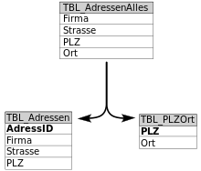

# Normalisierung

Unter Normalisierung in einer Datenbank versteht man die Aufteilung von Tabellen in mehrere kleinere Tabellen, um Redundanzen zu vermeiden und die Datenbank zu optimieren. Damit wird Inkonstistenz und Anomalien vermieden.

