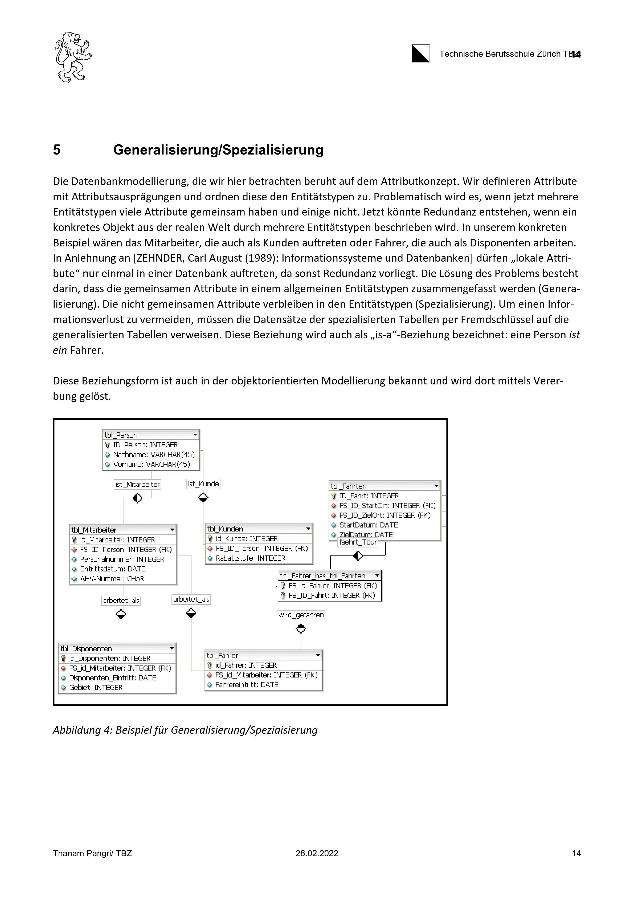

# Generalisierung/Spezialisierung

Mit Generalisierung und Spezialisierung wird die Beziehung zwischen einer allgemeinen Entität und einer speziellen Entität beschrieben. Die spezielle Entität ist eine Untermenge der allgemeinen Entität. Die allgemeine Entität wird als Oberklasse und die spezielle Entität als Unterklasse bezeichnet. Z.B. ist ein PKW eine spezielle Form eines Fahrzeugs. Ein PKW ist ein Fahrzeug, aber nicht jedes Fahrzeug ist ein PKW. Ein weiteres Beispiel ist eine Person die ein Kunde oder ein Mitarbeiter sein kann.

