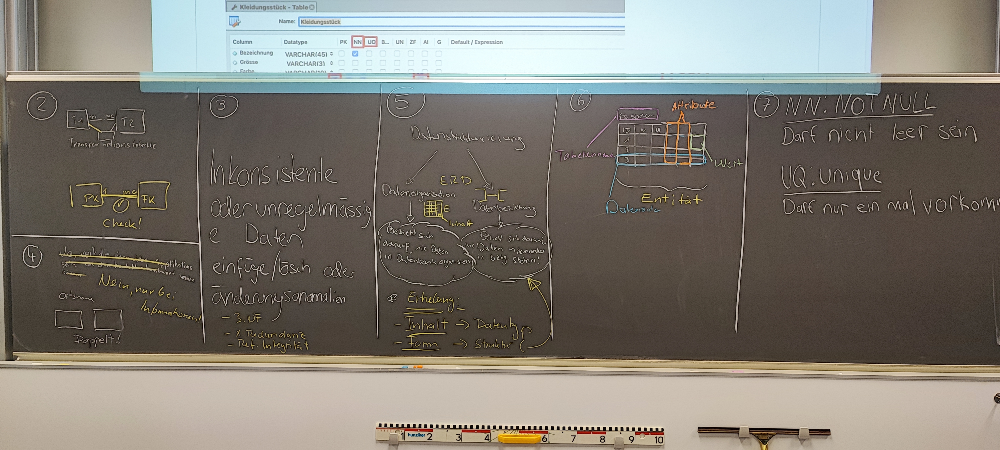

# Unterricht vom 23.02.2024

## Informationen vs. Daten

### Informationen

Informationen beziehen sich meistens auf eine Person, z.B. Name, Adresse, Telefonnummer, Geburtsdatum.

### Daten

Daten sind die Rohdaten, die in einer Datenbank gespeichert werden. Sie sind die Grundlage für die Erstellung von Informationen.

## Redundante Daten

Auf der Ebene von Daten kann man die Redundanz nicht definieren. Redundanz gibt es nur auf der Ebene von Informationen. Da Informationen aus Daten erstellt werden, können Daten nicht redundant sein.

.png>)

## Datenstrukturierung

Durch das ERD (Entity-Relationship-Diagramm) und Datenbezeichung.

- **Erhebung**: Erfolgt auf:
  - **Inhalt => Datentype**
  - **Form => Struktur**

